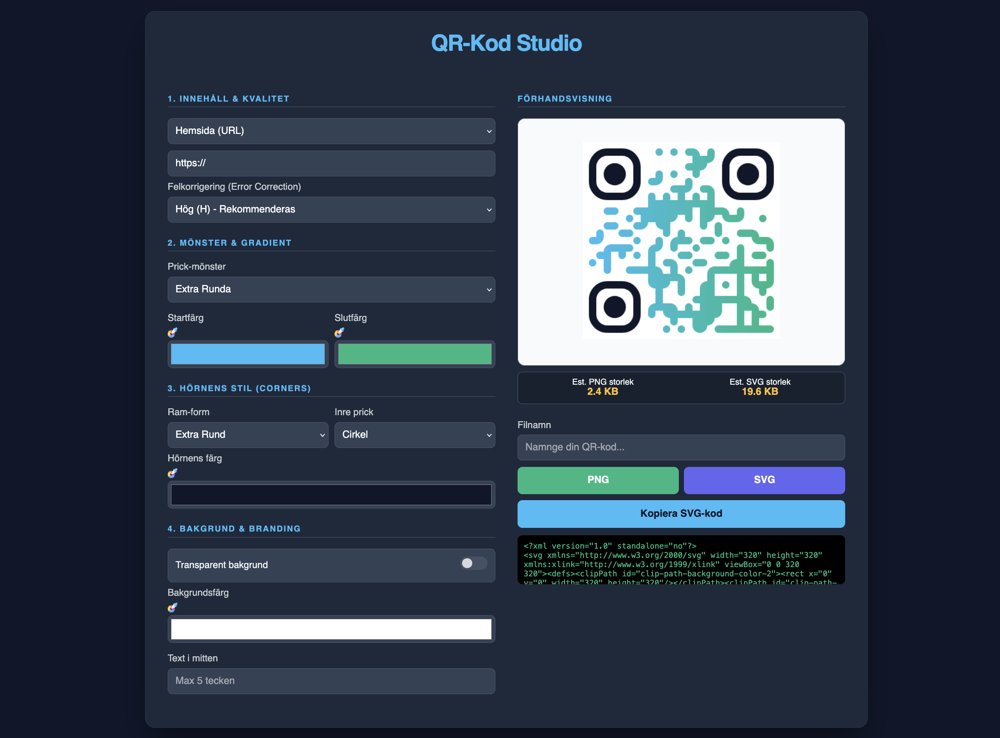

# QR-Kod-Generator-URL-WiFi-Meddelande-Tel-GPS
Låter dig generera en QR-kod för WiFi, URL, Meddelande, Telefon, och/eller GPS. Välj bakgrundsfärg eller transparent samt tillägg av fyra tecken som text. Ladda ner som PNG eller SVG. Du kan också kopiera SVG-koden.

Använder `` för att generera.

